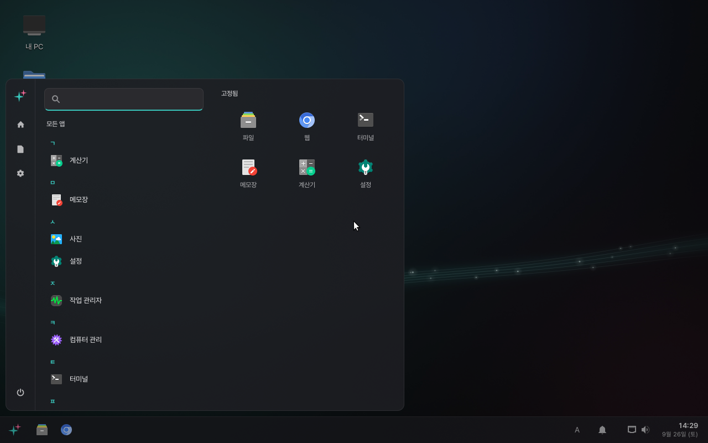
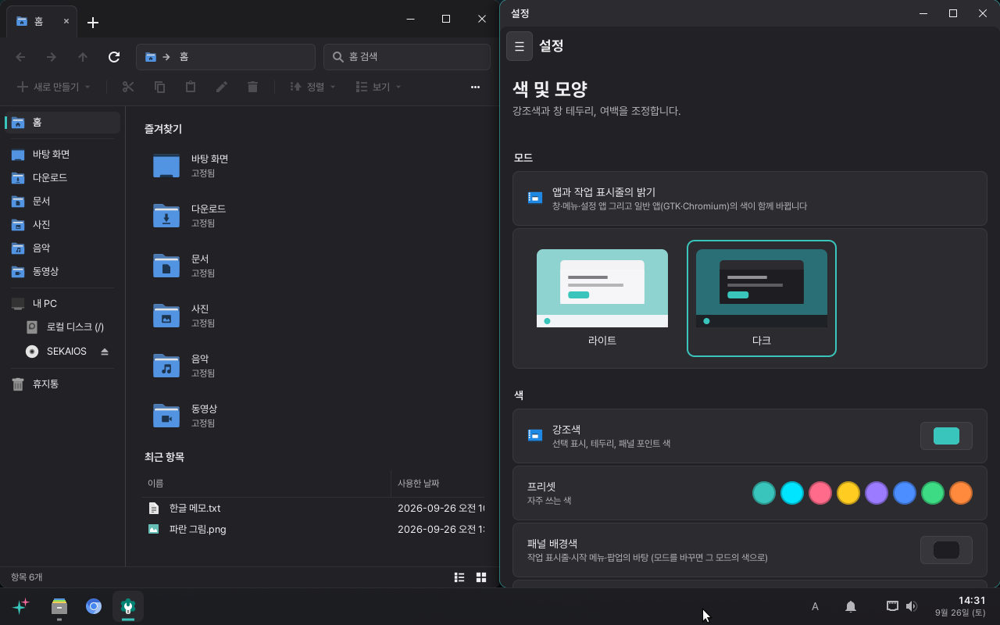

<p align="center">
  
</p>

<h1 align="center">SekaiOS</h1>

<p align="center">
  윈도우처럼 쓰는 리눅스 — 데비안 13 기반 데스크톱 배포판<br>
  <b>1.0 “Hatsune”</b> · 개발 중
</p>

<p align="center"><i>A Windows-like Linux desktop built on Debian 13. Korean-first. The desktop shell and its apps are written
from scratch in Python + GTK 3, running on the Hyprland compositor.</i></p>





## 소개

윈도우 11 을 쓰던 사람이 설명서 없이 바로 쓸 수 있는 리눅스 데스크톱을 목표로 한다.
작업 표시줄·시작 메뉴·창 배치·설정·파일 탐색기처럼 **화면에 보이는 것은 SekaiOS 가 직접 만들었고**,
그 밑은 안정적인 데비안 13 (trixie) 이다. 한국어가 기본이고(한글 입력이 처음부터 된다) 영어·일본어도 고를 수 있다.

## 상태

**개발 중이다.** 아직 내려받을 수 있는 설치 이미지(ISO)는 공개하지 않았다.
VMware 가상 머신과 실제 PC(AMD · NVIDIA 그래픽)에서 시험하고 있다. 버그와 제안은 [이슈](https://github.com/caterpillar321/sekaios/issues)로.

## 주요 기능

- **작업 표시줄** — 모니터마다, 앱 고정, 창 미리보기, 빠른 설정(Wi-Fi · 소리 · 밝기 · 블루투스), 알림 센터
- **시작 메뉴** — 앱 · 설정 항목 · 파일을 한 칸에서 찾고 계산도 한다 (한글 초성 · 한/영 잘못 친 글자도)
- **창 배치** — 화면 가장자리로 끌면 반쪽 · 4분의 1, 위로 끌면 스냅 레이아웃, Win+화살표, 스냅 도우미
- **기본 앱** — 파일 탐색기(탭) · 메모장 · 계산기 · 사진 · 작업 관리자 ·
  컴퓨터 관리(이벤트 뷰어 · 서비스 · 장치 관리자) · 설정(항목 검색)
- **보안** — 사용자 계정 컨트롤(관리자 권한 확인 창), 보안 부팅(shim + 데비안 서명 GRUB)
- **그래픽** — NVIDIA 드라이버는 설정 › 그래픽에서 설치. 드라이버가 없는 그래픽 카드는 자동으로 기본 화면 모드
- **설치** — 설치 프로그램과 첫 설정. 윈도우와 다른 디스크에 전용 부팅 파티션으로 설치해 서로 건드리지 않는다
- **업데이트** — 서명된 SekaiOS 저장소에서 자동으로 확인한다 (설정 › 업데이트)

## 시스템 요구 사항

| | |
|---|---|
| CPU | 64비트 x86 (x86_64) |
| 펌웨어 | UEFI (레거시 BIOS 는 지원하지 않는다). 보안 부팅은 켜 두어도 된다 |
| 메모리 | 4GB 이상 권장 (최소 2GB) |
| 디스크 | 12GB 이상 — 설치 프로그램은 고른 디스크 하나를 통째로 쓴다 |
| 그래픽 | Intel · AMD 는 바로. NVIDIA 는 설치 뒤 설정 › 그래픽에서 드라이버를 받는다 |

## 설치와 업데이트

- **설치 이미지** — 아직 공개하지 않았다. 직접 만들려면 아래 [직접 빌드하기](#직접-빌드하기)를 본다.
- **업데이트** — 설치된 SekaiOS 는 `https://caterpillar321.github.io/sekaios-apt/`(SekaiOS 서명 키로 서명)에서
  SekaiOS 부품을, 데비안 저장소에서 나머지를 받는다.

## SekaiOS 가 만든 것과 함께 쓰는 것

SekaiOS 의 화면은 직접 만들었다. 그 밑의 운영체제 부품(드라이버 · 네트워크 · 소리 · 인쇄 · 암호 저장 등)은
다른 리눅스 데스크톱들과 같은 공개 부품을 함께 쓴다 — 윈도우에서 보이는 창은 마이크로소프트가 만들어도
그 밑에 여러 회사의 드라이버와 표준 부품이 있는 것과 같다.

**직접 만든 것** (`src/sekai-shell`, Python + GTK 3)

- 작업 표시줄 · 시작 메뉴 · 알림 센터 · 빠른 설정 · 바탕화면 · 창 배치(스냅) · 스크린샷
- 로그인 화면 · 잠금 화면 · 첫 설정 · 설치 프로그램
- 설정 · 작업 관리자 · 컴퓨터 관리 · 파일 탐색기 · 메모장 · 계산기 · 사진
- 사용자 계정 컨트롤(관리자 권한 확인 창) · 네트워크 암호 창 · 암호 저장소 창
- 터미널 설정(`sekai-terminal` — kitty 를 윈도우 터미널처럼), 부팅 화면 테마, 이미지 · 패키지 빌드 도구

**고쳐서 쓰는 것** (원본 라이선스와 출처, 고친 내용을 함께 싣는다)

| 부품 | 쓰임 | 라이선스 · 고친 곳 |
|---|---|---|
| Hyprland 0.50.1, hyprbars, hyprexpo | 창을 그리는 합성기, 창 제목 표시줄 | BSD-3 · `scripts/hypr/patch-*.py` |
| Fluent-gtk-theme (vinceliuice) | GTK 테마 Sekai-Light · Sekai-Dark 의 바탕 | GPL-3.0 · `third_party/fluent-gtk-theme` |
| Plymouth | 부팅 화면 | GPL-2.0 · `scripts/hypr/patch-plymouth-*.py` |

**그대로 쓰는 기반** (데비안 13 패키지 — 화면에는 SekaiOS 창만 보인다)

| 부품 | 하는 일 |
|---|---|
| 데비안 13 · 리눅스 커널 · systemd · GRUB · shim | 운영체제 바탕, 부팅 |
| GTK 3 · gtk-layer-shell · PyGObject | SekaiOS 창을 그리는 도구 |
| NetworkManager · wpa_supplicant | 유선 · Wi-Fi 연결 (창은 설정 › 네트워크) |
| PipeWire · WirePlumber | 소리 (창은 설정 › 소리) |
| CUPS · avahi · ipp-usb | 인쇄 (창은 설정 › 프린터) |
| BlueZ | 블루투스 |
| udisks2 · gvfs | USB · 드라이브 연결 |
| polkit | 관리자 권한 확인 (창은 사용자 계정 컨트롤) |
| gnome-keyring · gcr | 앱이 저장한 암호를 암호화해 보관, 암호를 넘길 때의 암호화 (창은 암호 저장소 창) |
| xdg-desktop-portal (gtk · wlr) | 앱의 파일 고르기 · 화면 공유 · 스크린샷 요청 |
| ibus · ibus-hangul | 한글 입력 |
| greetd | 로그인 화면을 띄우는 관리자 (화면은 SekaiOS 로그인 화면) |
| xfwm4 · Xorg | 그래픽 드라이버가 없을 때의 기본 화면 모드 |
| kitty · foot | 터미널 |
| Papirus 아이콘 · DMZ-White 커서 · Pretendard · Noto 글꼴 | 아이콘 · 커서 · 글꼴 |
| Chromium | 웹 브라우저 |

## 저장소 구성

| 폴더 | 내용 |
|---|---|
| `src/sekai-shell/` | 셸과 앱 — 작업 표시줄, 바탕화면, 로그인 · 잠금 화면, 설정, 파일 탐색기 등 (패키지 `sekai-shell`) |
| `src/sekai-desktop/` | 배포판 설정 메타패키지 — Hyprland 설정, 테마, 부팅 화면, 기본 앱 목록 (패키지 `sekai-desktop`) |
| `src/sekai-installer/` | 설치 프로그램 (패키지 `sekai-installer`) |
| `overlay/`, `config/` | 설치 이미지에 직접 넣는 파일, 라이브 이미지 부트로더 설정 |
| `scripts/` | 빌드 스크립트, Hyprland · 플러그인 패치 (`scripts/hypr/`) |
| `third_party/` | 고쳐 쓰는 외부 원본과 그 라이선스 |
| `docs/` | 문서 · 스크린샷 |

## 직접 빌드하기

데비안 · 우분투 계열 호스트(WSL2 도 된다)에서, 관리자 권한(sudo)과 넉넉한 디스크(30GB 이상)가 필요하다.

```sh
sudo scripts/build-hypr.sh        # Hyprland 와 플러그인을 .deb 으로 (packages/)
scripts/pack-shell.sh             # sekai-shell · sekai-desktop · sekai-installer .deb
sudo scripts/finalize.sh          # rootfs 에 설치 → squashfs → ISO
scripts/build-repo.sh             # 서명된 apt 저장소 (repo/)
scripts/publish-repo.sh           # 저장소 게시
```

- 처음 `rootfs/` 를 만드는 과정(debootstrap)은 아직 스크립트로 정리되지 않았다.
- 저장소 서명 키는 이 저장소에 없다 — 직접 저장소를 만들려면 자신의 키를 쓴다.
- 개발용 이미지(`sudo env SEKAI_DEV=1 scripts/finalize.sh`)에는 `local/overlay-dev/` 의 개발자 SSH 키가 들어간다
  (`local/` 은 git 에 없다). 이름에 `-dev` 가 붙으며, 남에게 주면 안 된다.

## 라이선스

SekaiOS 의 코드는 [Apache License 2.0](LICENSE) 이다.
고쳐 쓰는 외부 부품은 각자의 라이선스를 따른다 — GTK 테마는 GPL-3.0(`third_party/fluent-gtk-theme/COPYING`),
Hyprland 와 플러그인은 BSD-3 이다. 패키지마다 `/usr/share/doc/<패키지>/copyright` 에 출처와 라이선스를 적었다.

SekaiOS 는 개인이 만드는 비공식 프로젝트로, SEGA · Colorful Palette · Crypton Future Media 와 관계가 없다.
