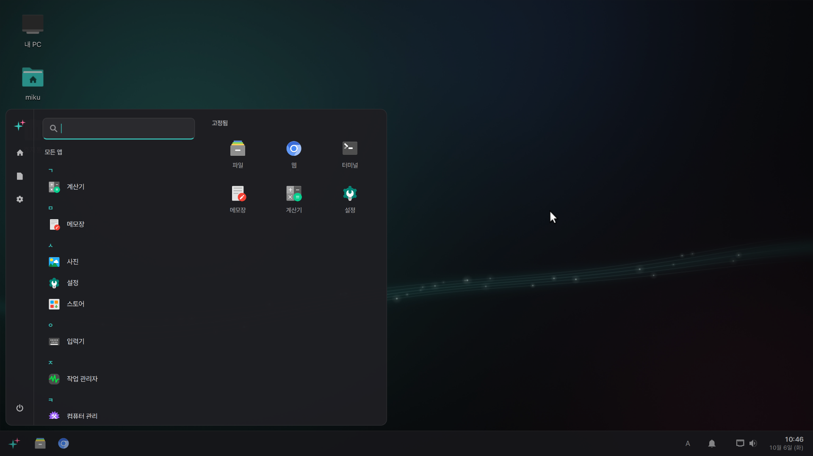
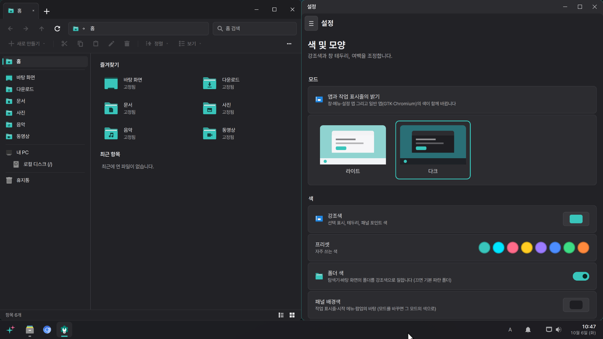

<p align="center">
  
</p>

<h1 align="center">SekaiOS</h1>

<p align="center">
  윈도우처럼 쓰는 리눅스 — 데비안 13 기반 데스크톱 배포판<br>
  <b>1.0 “Hatsune”</b> · 활발히 개발 중
</p>

<p align="center"><i>A Windows-like Linux desktop built on Debian 13. Korean-first. The desktop shell and its apps are written
from scratch in Python + GTK 3, running on WorldLink (our fork of the Hyprland compositor). Under active development.</i></p>





## 소개

SekaiOS 는 윈도우 11 을 쓰던 분이 설명서 없이 바로 쓸 수 있는 리눅스 데스크톱을 목표로 합니다.
작업 표시줄·시작 메뉴·창 배치·설정·파일 탐색기처럼 **화면에 보이는 것은 SekaiOS 가 직접 만들었고**,
그 밑은 안정적인 데비안 13 (trixie) 입니다. 한국어가 기본이며(한글 입력이 처음부터 됩니다) 영어·일본어도 고를 수 있습니다.

## 지금 상태

**한창 개발하고 있습니다.** 데스크톱의 주요 기능은 갖춰졌고, 지금은 실제로 매일 쓰면서 걸리는 부분을 다듬는 단계입니다.
설치 프로그램으로 실제 PC 에 설치해 쓸 수 있고, 설치된 SekaiOS 는 서명된 SekaiOS 저장소에서 업데이트를 받습니다.
다만 내려받을 수 있는 설치 이미지(ISO)는 아직 공개하지 않았습니다.

가상 머신(VMware · KVM)과 실제 PC(AMD · NVIDIA 그래픽, 다중 모니터)에서 시험하고 있습니다.
버그 제보와 제안은 [이슈](https://github.com/caterpillar321/sekaios/issues)로 남겨 주세요.

**최근에 한 일**

- 합성기를 Hyprland 패치 묶음에서 독자 포크인 **WorldLink**(`worldlink`, 처음 이름 SekaiCompose)로 옮겼습니다
- 데스크톱 환경(**SekaiDE**)을 배포판 부품과 나눠, 데비안에 데스크톱만 따로 깔 수 있게 했습니다
- 잘못 누르거나 끄는 도중 손을 떼는 등 **오조작 시험**으로 창 단추·끌기·작업 표시줄·대화상자의 버그를 잡았습니다
- 설치 USB 의 부팅 멈춤, 라이브 세션 잠금, 다중 모니터, 부팅 화면 깜박임 같은 실기 문제를 고쳤습니다
- 데비안 rootfs 를 처음부터 다시 만드는 빌드 스크립트를 갖췄습니다

## 주요 기능

- **작업 표시줄** — 모니터마다 하나씩, 앱 고정, 창 미리보기, 빠른 설정(Wi-Fi · 소리 · 밝기 · 블루투스), 알림 센터
- **시작 메뉴** — 앱 · 설정 항목 · 파일을 한 칸에서 찾고 계산도 합니다 (한글 초성, 한/영을 잘못 친 글자도 찾습니다)
- **창 배치** — 화면 가장자리로 끌면 반쪽 · 4분의 1, 위로 끌면 스냅 레이아웃, Win+화살표, 스냅 도우미
- **기본 앱** — 파일 탐색기(탭) · 메모장 · 계산기 · 사진 · 작업 관리자 ·
  컴퓨터 관리(이벤트 뷰어 · 서비스 · 장치 관리자) · 설정(항목 검색)
- **보안** — 사용자 계정 컨트롤(관리자 권한 확인 창), 보안 부팅(shim + 데비안 서명 GRUB)
- **그래픽** — NVIDIA 드라이버는 설정 › 그래픽에서 설치합니다. 드라이버가 없는 그래픽 카드는 자동으로 기본 화면 모드로 켜집니다
- **설치** — 설치 프로그램과 첫 설정. 윈도우와 다른 디스크에 전용 부팅 파티션으로 설치해 서로 건드리지 않습니다
- **업데이트** — 서명된 SekaiOS 저장소에서 자동으로 확인합니다 (설정 › 업데이트)

## 시스템 요구 사항

| | |
|---|---|
| CPU | 64비트 x86 (x86_64) |
| 펌웨어 | UEFI (레거시 BIOS 는 지원하지 않습니다). 보안 부팅은 켜 두셔도 됩니다 |
| 메모리 | 4GB 이상 권장 (최소 2GB) |
| 디스크 | 12GB 이상 — 설치 프로그램은 고른 디스크 하나를 통째로 씁니다 |
| 그래픽 | Intel · AMD 는 바로 됩니다. NVIDIA 는 설치 뒤 설정 › 그래픽에서 드라이버를 받습니다 |

## SekaiDE 만 쓰기

SekaiOS 의 데스크톱 환경(SekaiDE)은 배포판과 따로 깔 수 있습니다. 데비안 13(trixie)에 SekaiOS 저장소를 더한 뒤
`sudo apt install sekai-de` 하시면 셸·로그인 화면·합성기(WorldLink)가 들어오고, 부팅·업데이트 같은 배포판 부품
(`sekaios-base`)은 깔리지 않습니다. (설정 앱의 그래픽 드라이버·업데이트 페이지는 그 부품이 있을 때만 보입니다)

## 설치와 업데이트

- **설치 이미지** — 아직 공개하지 않았습니다. 직접 만드시려면 아래 [직접 빌드하기](#직접-빌드하기)를 참고해 주세요.
- **업데이트** — 설치된 SekaiOS 는 `https://caterpillar321.github.io/sekaios-apt/`(SekaiOS 서명 키로 서명)에서
  SekaiOS 부품을, 데비안 저장소에서 나머지를 받습니다.

## SekaiOS 가 만든 것과 함께 쓰는 것

SekaiOS 의 화면은 직접 만들었습니다. 그 밑의 운영체제 부품(드라이버 · 네트워크 · 소리 · 인쇄 · 암호 저장 등)은
다른 리눅스 데스크톱들과 같은 공개 부품을 함께 씁니다. 윈도우에서 보이는 창은 마이크로소프트가 만들었어도
그 밑에 여러 회사의 드라이버와 표준 부품이 있는 것과 같습니다.

**직접 만든 것** (`src/sekai-shell`, Python + GTK 3)

- 작업 표시줄 · 시작 메뉴 · 알림 센터 · 빠른 설정 · 바탕화면 · 창 배치(스냅) · 스크린샷
- 로그인 화면 · 잠금 화면 · 첫 설정 · 설치 프로그램
- 설정 · 작업 관리자 · 컴퓨터 관리 · 파일 탐색기 · 메모장 · 계산기 · 사진
- 사용자 계정 컨트롤(관리자 권한 확인 창) · 네트워크 암호 창 · 암호 저장소 창
- 터미널 설정(`sekai-terminal` — kitty 를 윈도우 터미널처럼), 부팅 화면 테마, 이미지 · 패키지 빌드 도구

**고쳐서 쓰는 것** (원본 라이선스와 출처, 고친 내용을 함께 싣습니다)

| 부품 | 쓰임 | 라이선스 · 고친 곳 |
|---|---|---|
| [WorldLink](https://github.com/caterpillar321/sekaicompose) — Hyprland 0.50.1 + hyprbars 의 포크 | 창을 그리는 합성기, 창 제목 표시줄 | BSD-3 · 포크의 커밋 (`git log v0.50.1..sekai`) |
| hyprexpo | 작업 보기 플러그인 | BSD-3 · 원본 그대로 |
| Fluent-gtk-theme (vinceliuice) | GTK 테마 Sekai-Light · Sekai-Dark 의 바탕 | GPL-3.0 · `third_party/fluent-gtk-theme` |
| Plymouth | 부팅 화면 | GPL-2.0 · `scripts/hypr/patch-plymouth-*.py` |

**그대로 쓰는 기반** (데비안 13 패키지 — 화면에는 SekaiOS 창만 보입니다)

| 부품 | 하는 일 |
|---|---|
| 데비안 13 · 리눅스 커널 · systemd · GRUB · shim | 운영체제 바탕, 부팅 |
| GTK 3 · gtk-layer-shell · PyGObject | SekaiOS 창을 그리는 도구 |
| NetworkManager · wpa_supplicant | 유선 · Wi-Fi 연결 (창은 설정 › 네트워크) |
| PipeWire · WirePlumber | 소리 (창은 설정 › 소리) |
| CUPS · avahi · ipp-usb | 인쇄 (창은 설정 › 프린터) |
| BlueZ | 블루투스 |
| udisks2 · gvfs | USB · 드라이브 연결 |
| polkit | 관리자 권한 확인 (창은 사용자 계정 컨트롤) |
| gnome-keyring · gcr | 앱이 저장한 암호를 암호화해 보관, 암호를 넘길 때의 암호화 (창은 암호 저장소 창) |
| xdg-desktop-portal (gtk · wlr) | 앱의 파일 고르기 · 화면 공유 · 스크린샷 요청 |
| ibus · ibus-hangul | 한글 입력 |
| greetd | 로그인 화면을 띄우는 관리자 (화면은 SekaiOS 로그인 화면) |
| xfwm4 · Xorg | 그래픽 드라이버가 없을 때의 기본 화면 모드 |
| kitty · foot | 터미널 |
| Papirus 아이콘 · DMZ-White 커서 · Pretendard · Noto 글꼴 | 아이콘 · 커서 · 글꼴 |
| Chromium | 웹 브라우저 |

## 저장소 구성

| 폴더 | 내용 |
|---|---|
| `src/sekai-shell/` | 셸과 앱 — 작업 표시줄, 바탕화면, 로그인 · 잠금 화면, 설정, 파일 탐색기 등 (패키지 `sekai-shell`) |
| `src/sekai-de/` | SekaiDE — 세션·로그인 화면·잠금·첫 설정·합성기 설정·테마·아이콘·배경 (패키지 `sekai-de`) |
| `src/sekaios-base/` | 배포판 부품 — os-release·부팅(GRUB·Plymouth·initramfs)·업데이트 저장소·그래픽 드라이버 도구 (패키지 `sekaios-base`) |
| (패키지 `sekai-desktop`) | 메타패키지 — `sekai-de` + `sekaios-base` + 드라이버·펌웨어·인쇄·소리·기본 앱 |
| `src/sekai-installer/` | 설치 프로그램 (패키지 `sekai-installer`) |
| `overlay/`, `config/` | 설치 이미지에 직접 넣는 파일, 라이브 이미지 부트로더 설정 |
| `scripts/` | 빌드 스크립트 (`scripts/hypr/` — WorldLink·Hyprland 라이브러리 빌드, Plymouth 패치) |
| `third_party/` | 고쳐 쓰는 외부 원본과 그 라이선스 |
| `docs/` | 문서 · 스크린샷 |

## 직접 빌드하기

데비안 · 우분투 계열 호스트(WSL2 도 됩니다)에서 관리자 권한(sudo)과 넉넉한 디스크(30GB 이상)가 필요합니다.

```sh
sudo scripts/mkrootfs.sh && sudo scripts/mkrootfs.sh --replace   # 데비안 rootfs 를 처음부터 (config/rootfs-packages.list)
sudo scripts/build-hypr.sh        # WorldLink(합성기)·라이브러리·플러그인을 .deb 으로 (packages/)
scripts/pack-shell.sh             # sekai-shell · sekai-de · sekaios-base · sekai-desktop · sekai-installer .deb
sudo scripts/finalize.sh          # rootfs 에 설치 → squashfs → ISO
scripts/build-repo.sh             # 서명된 apt 저장소 (repo/)
scripts/publish-repo.sh           # 저장소 게시
```

- 호스트에 `mmdebstrap` 과 trixie 키가 든 `debian-archive-keyring`(2025.1 이상)이 필요합니다.
- 저장소 서명 키는 이 저장소에 없습니다. 직접 저장소를 만드시려면 본인의 키를 쓰시면 됩니다.
- 개발용 이미지(`sudo env SEKAI_DEV=1 scripts/finalize.sh`)에는 `local/overlay-dev/` 의 개발자 SSH 키가 들어갑니다
  (`local/` 은 git 에 없습니다). 이름에 `-dev` 가 붙으며, 다른 사람에게 주시면 안 됩니다.

## 라이선스

SekaiOS 의 코드는 [Apache License 2.0](LICENSE) 입니다.
고쳐 쓰는 외부 부품은 각자의 라이선스를 따릅니다. GTK 테마는 GPL-3.0(`third_party/fluent-gtk-theme/COPYING`),
WorldLink(Hyprland 포크)와 플러그인은 BSD-3 입니다. 패키지마다 `/usr/share/doc/<패키지>/copyright` 에 출처와 라이선스를 적었습니다.

SekaiOS 는 개인이 만드는 비공식 프로젝트로, SEGA · Colorful Palette · Crypton Future Media 와 관계가 없습니다.
